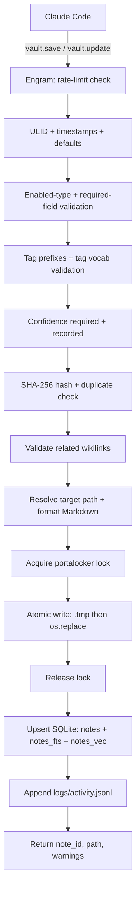
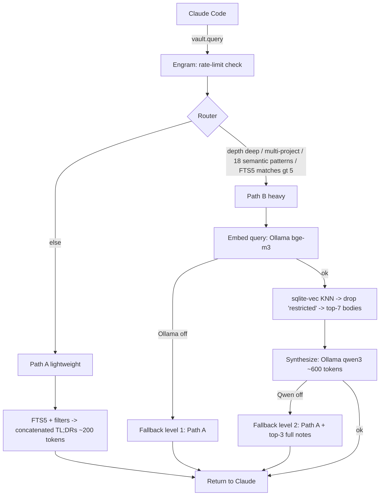

# Engram v3.0 — System Documentation

Persistent, continuous memory for software development with Claude Code.
This document describes the implemented architecture, data model, write and
read paths, the six Graphify-inspired features, session handoff, the MCP tool
surface, configuration, and testing strategy.

> Design source of truth: `docs/specs/2026-06-01-engram-v3-design.md`.

---

## 1. Overview / Purpose

Engram is an MCP server that gives Claude Code persistent memory across
development sessions. Decisions, bugs, patterns, runbooks, concepts, and
session state are captured during development, organized semantically in an
Obsidian vault, and retrieved efficiently on demand — instead of being
rebuilt from scratch each session (costly in tokens, slow, inconsistent).

The name "Engram" refers to the physical trace a memory leaves in the brain:
each note is a persistent memory trace of the development process.

**Priorities (in order):** efficiency → processing economy → quality.

These priorities drive three defining decisions:

- **Zero-LLM writes.** Saving a note is 100% Python. No model call is made to
  persist memory, so capture is fast, deterministic, and free.
- **Local-Ollama-only reads.** Heavy semantic retrieval uses a local Ollama
  instance (`bge-m3` for embeddings, `qwen3` for synthesis). No external LLM
  API is ever called for retrieval. If Ollama is offline, retrieval degrades
  gracefully rather than failing.
- **CLI-first maintenance.** Reindexing, watching, importing, clustering, and
  status run from the CLI without involving Claude, costing zero tokens.

---

## 2. Architecture

### 2.1 Modular monolith

Engram is a single Python package (`engram/`). One install serves both the
MCP server and the CLI. Shared state — the SQLite connection and the loaded
configuration — flows through small, single-responsibility `core/` modules.
This was chosen over microkernel/layered/plugin approaches because the project
targets 1–2 developers, efficiency is the priority (fewer abstractions = less
overhead), and YAGNI applies (the design can be refactored toward plugins or
layers later if it grows).

Each `core/` module owns one responsibility and is independently testable. All
modules share `db.py` (the connection) and `config.py` (settings).

### 2.2 Actors

| Actor | Role |
|-------|------|
| **Claude Code** | Orchestrator. Decides when to save and when to query. Synthesizes note bodies with full conversation context, then hands structured data to Engram. |
| **Engram MCP server (Python)** | The interface between Claude Code and the vault. Exposes six MCP tools. Writes are 100% Python; reads are routed across two paths. Every tool is rate-limited. |
| **Ollama (local)** | Runs `bge-m3` (embeddings, 1024-dim) and `qwen3` (synthesis). Optional — the read path falls back to lightweight search when Ollama is offline. |
| **Obsidian vault** | The persistent Markdown store. Human-navigable via Obsidian's Graph View. Notes are never hard-deleted; `status: archived` filters them out. |
| **SQLite + FTS5 + sqlite-vec** | The search index: structured metadata, full-text (FTS5), and vector search (sqlite-vec). Invisible to the user. |

### 2.3 Component map

```
engram/
├── config.py          # vault root, enabled types, Ollama endpoint, limits
├── models.py          # Pydantic: NoteData, QueryRequest; NoteType, Confidence enums
├── server.py          # MCP server (FastMCP, stdio) — 6 tools; entry point engram-server
├── cli.py             # CLI: status, reindex, watch, import-graph, cluster
├── core/
│   ├── db.py          # SQLite connection, schema, sqlite-vec load
│   ├── validator.py   # required fields, tag vocab, tag prefixes, wikilinks
│   ├── writer.py      # vault_save + vault_update (lock, hash, atomic write)
│   ├── router.py      # lightweight (Path A) vs heavy (Path B) decision
│   ├── reader.py      # Path A (FTS5) + Path B (embeddings + Qwen synthesis)
│   ├── embeddings.py  # Ollama bge-m3 embeddings + qwen3 synthesis (local only)
│   ├── indexer.py     # hash, duplicate check, upsert into notes/notes_fts/notes_vec
│   ├── fsio.py        # atomic write, Markdown formatting
│   ├── paths.py       # type→folder mapping, activity log
│   ├── locking.py     # portalocker-based vault lock
│   ├── rate_limit.py  # in-memory sliding window per tool
│   ├── reindex.py     # incremental, hash-skipped rebuild
│   ├── hubs.py        # vault status + hub-note ranking
│   ├── clustering.py  # cosine-threshold community clustering
│   └── watcher.py     # watchdog-driven incremental reindex
├── importers/
│   └── graphify.py    # graph.json → context notes
└── hooks/
    ├── pre_tool_use.py    # context-budget monitor (handoff thresholds)
    └── session_start.py   # latest-handoff injection
```

---

## 3. Data model

### 3.1 Note types (7 active, 11 prepared)

`NoteType` (`engram/models.py`) defines eleven types. Seven are active in
v3.0; four are prepared (defined in the enum, folder mapping and templates
exist) but disabled in config until v3.1.

```python
class NoteType(str, Enum):
    # v3.0 active
    DECISION = "decision"
    BUG = "bug"
    PATTERN = "pattern"
    CONTEXT = "context"
    RUNBOOK = "runbook"
    SESSION = "session"
    CONCEPT = "concept"
    # v3.1 prepared (disabled in config)
    POST_MORTEM = "post-mortem"
    EXPERIMENT = "experiment"
    REFACTORING = "refactoring"
    METRIC = "metric"
```

Active types are config-driven, not hardcoded: `config.enabled_types` (default
the seven above) gates `vault_save`. Activating the remaining four is a config
change — add them to `[types].enabled` — not a code change.

### 3.2 Confidence enum

A required frontmatter field, adapted from Graphify's extraction-confidence
model. It lets retrieval distinguish verified facts from guesses.

```python
class Confidence(str, Enum):
    FACT = "fact"             # verified: test passed, decision made
    INFERENCE = "inference"   # derived through analysis
    HYPOTHESIS = "hypothesis" # unconfirmed
```

`confidence` is mandatory on save (no silent default) and surfaced on every
source the read path returns, including the heavy synthesis path.

### 3.3 Frontmatter schema

Each note carries YAML frontmatter. Required fields (validated on save):

```
id, title, tldr, type, confidence, status, created, updated, author, scope, tags
```

Required tag prefixes: `tipo/`, `maturidade/`, `dominio/`.

Optional fields: `subtype, parent, project, module, related[], implements,
supersedes, code_refs, session_id, confidentiality, schema_version`.

`confidentiality` defaults to `internal`; the value `restricted` is honored by
the read path (§5.3) and never sent to the synthesis LLM.

### 3.4 SQLite schema

The index lives in `.engram.db` inside the vault root and has three tables.

```sql
CREATE TABLE notes (
    id TEXT PRIMARY KEY,
    title TEXT NOT NULL,
    tldr TEXT,
    type TEXT NOT NULL,
    subtype TEXT,
    confidence TEXT NOT NULL,
    scope TEXT DEFAULT 'project',
    project TEXT,
    module TEXT,
    status TEXT DEFAULT 'active',        -- supports 'archived' (cold-storage future)
    created TEXT NOT NULL,
    updated TEXT NOT NULL,
    author TEXT DEFAULT 'claude',
    tags_json TEXT,
    content_hash TEXT,                   -- SHA-256[:32]
    file_path TEXT,                      -- any path (cold-storage future = path change)
    confidentiality TEXT DEFAULT 'internal',
    schema_version INTEGER DEFAULT 1
);

CREATE VIRTUAL TABLE notes_fts USING fts5(
    note_id UNINDEXED, title, tldr, tags_text, body_snippet
);

-- notes_vec: sqlite-vec virtual table, created at runtime
-- vec0(note_id TEXT PRIMARY KEY, embedding float[1024])  -- bge-m3, 1024-dim
```

`notes_fts` is populated from Python (no triggers), keeping FTS5 consistency in
the indexer rather than in SQL. `notes_vec` is created after the `vec0`
extension is loaded in `connect()`.

**Cold-storage future-proofing.** `status` already accepts `archived` and
`file_path` accepts any path, so moving a note to a future cold tier is a path
update plus a filter — no schema migration. The read path already excludes
`_cold/` paths when `include_cold` is false.

---

## 4. Write path

The write path is 100% Python with zero LLM involvement. There is **no
sweeper** and no `_pending/` staging directory.

### 4.1 No sweeper — atomic write + lock

An earlier design staged writes into `_pending/` and ran a daemon thread that
polled every few seconds for an idle editor before moving files into place.
That was cut: it solved a rare problem (an editor having the exact note open
the instant Engram writes it) at high cost — an extra thread, race conditions,
sidecar bookkeeping, added latency, and deferred index consistency.

The real risk — a concurrent or partial write — is fully covered by two cheap
mechanisms:

1. **portalocker** — a cross-platform exclusive lock (`.engram.lock`) held for
   the duration of the file write, serializing concurrent writers.
2. **Atomic write** — write to a `.tmp` sibling, then `os.replace()` (atomic on
   both Windows and POSIX). Obsidian never observes a partial file, and a crash
   mid-write leaves a stray `.tmp`, never a corrupt target.

```python
tmp = target.with_suffix(target.suffix + ".tmp")
tmp.write_text(markdown, encoding="utf-8")
os.replace(tmp, target)   # atomic
```

### 4.2 Obsidian conflict scenarios

| Scenario | Handling |
|----------|----------|
| Obsidian has note X open and Engram updates X | `os.replace` swaps in a complete file. Obsidian detects the external change and reloads (its native behavior). No corruption. |
| A human edits X in Obsidian while Engram writes X | portalocker serializes the writers; last writer wins at the file level. Mitigated because `vault_update` reads the current file first and overwrites only changed fields, preserving the human's edits to other fields. |
| Crash mid-write | A `.tmp` orphan is left and the target is untouched. Stale `.tmp` files are cleaned up on startup. |
| Concurrent Engram writes (multi-agent future) | The portalocker exclusive lock serializes them: each acquires, writes, and releases in turn. |

The lock and schema do not preclude re-introducing a queue/sweeper later if a
future scenario (multiple concurrent agents *plus* a live human editor on the
same notes) ever justifies it. That is not the current case (YAGNI).

### 4.3 `vault_save()` pipeline

`vault_save(note, body, config, conn)` (`core/writer.py`) runs entirely in
Python:

1. **Rate-limit check** — per-tool sliding window (default 30 calls / 60 s).
2. **Generate ULID** if no `id` was supplied.
3. **Set timestamps and defaults** — `created` (if absent) and `updated`.
   `confidence` is required and never silently defaulted.
4. **Enabled-type gate** — reject types not in `config.enabled_types`.
5. **Validate required fields** — including `confidence`.
6. **Validate required tag prefixes** — `tipo/`, `maturidade/`, `dominio/`.
7. **Validate tags against vocabulary** — loaded from the vault's tag vocab;
   on failure, return a sample of valid tags.
8. **Validate TL;DR length** — warn (non-blocking) if over 20 words.
9. **Compute content hash** (SHA-256, 32 hex chars) and **duplicate check** —
   an identical body is rejected.
10. **Validate wikilinks** in `related[]` — SQLite-first, filesystem fallback;
    broken links are a warning, not an error.
11. **Determine target path** from the type→folder mapping.
12. **Format Markdown** — YAML frontmatter plus body.
13. **Acquire lock → atomic write (`.tmp` → `os.replace`) → release lock.**
14. **Upsert into SQLite** — `notes`, `notes_fts`, and `notes_vec` (the
    embedding is written if Ollama is available; absence is non-fatal).
15. **Append to the activity log** (`logs/activity.jsonl`).
16. **Return** `{status, note_id, path, warnings}`.

### 4.4 `vault_update()` — partial edit

`vault_update(note_id, updates, body, config, conn)` performs a field-level
edit that preserves human edits:

- **Immutable fields** are rejected: `{id, created, type, subtype, parent}`.
- The current file is **read first**; only the keys present in `updates` are
  changed, and untouched frontmatter (including manual human edits) is kept.
- `updated` is refreshed. The body is replaced only if a new body is supplied;
  the content hash is recomputed only when the body changes.
- Changed tags and changed `related[]` wikilinks are re-validated.
- The same lock + atomic-write path is used, followed by a SQLite upsert and an
  activity-log entry recording the field-level diff.

### 4.5 Write-path flow



There is deliberately no `_pending/` staging step and no sweeper thread in this
flow.

---

## 5. Read path

Retrieval is dual-path with an intelligent router. Most queries take the cheap
lightweight path; only those needing semantic reasoning take the heavy path.

### 5.1 Router rules

`route_query()` (`core/router.py`) returns `heavy` (Path B) or `lightweight`
(Path A). It chooses **heavy** when any of these hold:

- `depth == "deep"`.
- The query spans multiple projects, or targets all projects via `*`.
- The query text matches one of **18 bilingual semantic patterns** (Portuguese
  and English regexes covering intent like impact/affects, relationship,
  migrate/replace, "all decisions/bugs/patterns", summary/overview,
  why/rationale, compare, history/timeline, alternatives).
- An FTS5 pre-count of matches is **greater than 5** (a broad query benefits
  from synthesis).

Otherwise the router returns **lightweight**.

### 5.2 Path A — lightweight (~70% of queries)

FTS5 search joined to `notes`, filtered by project, status (archived excluded
by default), type, and `_cold/` exclusion. Returns the matched notes' TL;DRs,
each tagged with its type and confidence, concatenated into a compact summary.
Zero LLM. ~200 tokens.

### 5.3 Path B — heavy (~30% of queries)

1. **Embed the query** with Ollama `bge-m3`.
2. **Vector search** `notes_vec` (sqlite-vec KNN, ordered by distance),
   excluding archived notes.
3. **Confidentiality filter** — any `restricted` note is dropped before
   anything reaches the LLM; the count of omitted notes is reported.
4. **Read the top-7 note bodies**, each labeled with type and confidence.
5. **Synthesize** with Ollama `qwen3` (a bilingual prompt that shows the
   confidence of each source). ~600 tokens.

### 5.4 Two-level fallback — never blocks

The read path degrades gracefully and never blocks Claude:

- **Embeddings unavailable** (Ollama off): Path B returns Path A results
  immediately, marked `B-fallback` with `fallback_used: true`.
- **Synthesis unavailable** (Qwen off) after a successful vector search: fall
  back to Path A plus the top-3 full note bodies appended, marked
  `B-fallback`.
- An embedding failure during a *save* is also non-fatal: the note is stored
  without a vector and remains fully searchable via FTS5.

### 5.5 Read-path flow



---

## 6. Six Graphify-inspired features

| # | Feature | What it does | Interface |
|---|---------|--------------|-----------|
| 1 | **Confidence tags** | Required `confidence` (fact/inference/hypothesis) in frontmatter and SQLite; validated on save; surfaced on every read source. | MCP (save/update) |
| 2 | **SHA-256 incremental reindex** | `reindex` compares each file's hash to the stored `content_hash` and skips unchanged notes, eliminating wasted reprocessing. | CLI (`engram reindex`) |
| 3 | **Watch mode** | `watch` uses watchdog to monitor the vault; manual edits in Obsidian trigger a single-file, hash-checked reindex. | CLI (`engram watch`) |
| 4 | **Hub notes** | `hubs.py` ranks the most-linked notes by inbound wikilink count (degree centrality), reported alongside vault stats. | MCP (`vault.status`) / CLI (`engram status`) |
| 5 | **Graphify import** | `import-graph` converts a Graphify `graph.json` into context notes; edges become `related[]` wikilinks. | CLI (`engram import-graph`) |
| 6 | **Community clustering** | `clustering.py` builds a similarity graph over note embeddings and groups them by a cosine threshold (connected components), writing `_clusters.md` per project. Run on demand (CPU cost). | CLI (`engram cluster`) |

Features 2, 3, 5, and 6 are CLI-first by design: they never involve Claude, so
they cost zero tokens, honoring the economy priority.

> Note on clustering: the v3.0 implementation groups notes via cosine-threshold
> connected components. True Leiden community detection is an optional install
> (`pip install -e ".[clustering]"`) reserved for larger vaults.

---

## 7. Session management & handoff

Engram monitors context usage and produces a clean handoff before Claude's
reasoning degrades, so a new session resumes with a compact summary instead of
a near-full window.

```
PreToolUse hook (engram/hooks/pre_tool_use.py), on every tool call:
  read accumulated estimate -> add incremental tokens -> write it back
    < 35%   normal
    35-50%  warning: "be concise, prepare handoff"
    >= 50%  critical: "initiate handoff NOW" -> Claude calls vault.handoff
```

- **`vault.handoff`** generates a `type: session` note capturing open
  decisions, active files, next steps, and the git branch, saved under the
  sessions folder.
- **SessionStart hook** (`engram/hooks/session_start.py`) finds the latest
  handoff for the project (by modification time) and injects it via
  `additionalContext`, so a new session starts around ~8% context instead of
  the ~50% at which the prior one closed.

The 35% / 50% thresholds reflect that reasoning quality degrades well before a
window is full; exiting early with clean context beats squeezing until
incoherent. Both thresholds are configurable (`limits.context_warning_pct`,
`limits.context_critical_pct`).

---

## 8. MCP tools (6)

The server (`engram/server.py`, FastMCP over stdio) exposes six tools. Every
tool passes through the in-memory rate limiter first.

| Tool | Purpose | Path |
|------|---------|------|
| `vault.save` | Create a note | Write |
| `vault.update` | Partial edit of an existing note | Write |
| `vault.query` | Default query; router auto-selects Path A or Path B | Read |
| `vault.deep_query` | Force the heavy semantic path (Path B) | Read |
| `vault.status` | Vault statistics plus hub notes | Read |
| `vault.handoff` | Save session state as a handoff note | Write |

`vault.query` runs the router and dispatches to `path_a` or `path_b`.
`vault.deep_query` forces `depth=deep`, guaranteeing Path B (with the same
two-level fallback). `vault.status` returns totals broken down by type and by
confidence, plus the top hub notes.

---

## 9. Configuration

Configuration loads from `engram.toml` (current directory or
`~/.engram/engram.toml`), with environment-variable overrides. Defaults make
the system runnable with no config file (vault at `~/.engram/vault`).

```toml
[vault]
root = "C:/Users/ianfl/dev-vault"   # default ~/.engram/vault

[types]
enabled = ["decision","bug","pattern","context","runbook","session","concept"]

[embeddings]
provider = "ollama"
model    = "bge-m3"
endpoint = "http://localhost:11434"

[synthesis]
model = "qwen3:7b"

[limits]
rate_calls            = 30
rate_window_seconds   = 60
lock_timeout_seconds  = 5
context_warning_pct   = 35
context_critical_pct  = 50
```

Key environment overrides: `ENGRAM_VAULT_ROOT` (vault location) and
`ENGRAM_OLLAMA_ENDPOINT` (embeddings/synthesis endpoint). The SQLite index
(`.engram.db`) and the activity log (`logs/activity.jsonl`) live under the
vault root.

---

## 10. Testing strategy

Engram is developed test-driven: tests are written before each module's
implementation. The suite (~96 tests) runs on `pytest` with `pytest-asyncio`.

- **Isolated vault** — a temporary vault fixture (`tmp_path`) per test; **Ollama
  is mocked** so there is no external dependency in CI.
- **Coverage targets** — high overall coverage of `core/`, with the validator
  and router (the critical decision logic) held to 100%.
- **Contract tests** — each MCP tool is checked against its input/output
  schema.
- **Type coverage** — parametrized tests span all eleven note types; the four
  v3.1-prepared types are marked skipped.
- **Feature matrix** — confidence enforcement, incremental hash skip, hub
  ranking, cluster determinism, Graphify import round-trip, atomic-write crash
  safety, and the Obsidian conflict scenarios each have dedicated tests.

---

## 11. CLI commands

The CLI (`engram/cli.py`, Typer) provides token-free maintenance operations:

| Command | Purpose |
|---------|---------|
| `engram status` | Vault stats (totals by type and confidence) plus hub notes. |
| `engram reindex` | Incremental SQLite rebuild; unchanged notes are skipped by hash. |
| `engram watch` | Watch the vault and reindex incrementally on external edits. |
| `engram import-graph <graph.json> <project>` | Import a Graphify graph as context notes. |
| `engram cluster <project> [--threshold 0.75]` | Cluster a project's notes by embedding similarity into `_clusters.md`. |

The MCP server runs separately via the `engram-server` entry point.

---

## 12. Post-v3.0 backlog

Deferred items (cold-storage tier, the four v3.1 note types, optional true
Leiden clustering, and other enhancements) are tracked in `docs/backlog.md`.
